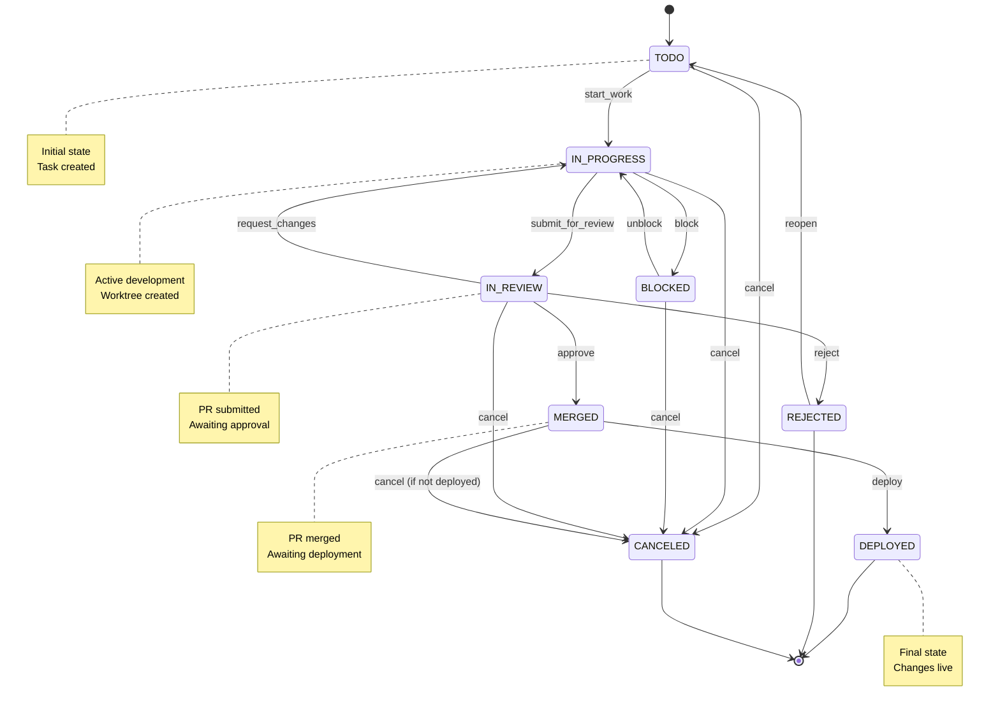
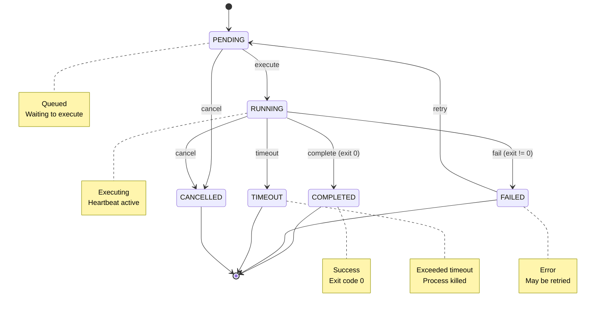
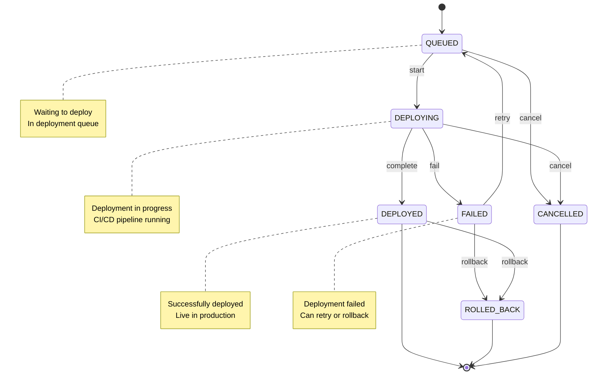

# FSM State Diagrams - Visual Reference

This document provides ASCII and Mermaid diagrams for visualizing the state machines.

## Issue State Machine

### Mermaid Diagram



### ASCII Diagram

```
┌──────────────────────────────────────────────────────────────────┐
│                      ISSUE LIFECYCLE FSM                          │
└──────────────────────────────────────────────────────────────────┘

                        ╔════════╗
                        ║  TODO  ║ (Initial State)
                        ╚═══╤════╝
                            │ start_work [hasAssignee && noActiveWorktree]
                            ▼
                    ┌───────────────┐
                    │  IN_PROGRESS  │◄─────┐
                    └───┬───────┬───┘      │
                        │       │          │ unblock
              submit_   │       │ block    │ [blockingReasonResolved]
              for_review│       │          │
              [hasCommits]      │          │
                        │       ▼          │
                        │   ┌─────────┐    │
                        │   │ BLOCKED │────┘
                        │   └─────────┘
                        │
                        ▼
                  ┌───────────┐
                  │ IN_REVIEW │
                  └─┬───┬───┬─┘
                    │   │   │
    request_changes │   │   │ reject
                    │   │   │
                    ▼   │   ▼
              ┌─────────┐ ┌──────────┐
              │IN_PROGRESS│ │ REJECTED │ (Final)
              └─────────┘ └────┬─────┘
                              │ reopen
                    approve   │ [hasPermission]
                    [hasApprovals &&│
                     passesCI &&    │
                     noConflicts]   │
                              │     │
                    ┌─────────┐     │
                    │ MERGED  │     │
                    └────┬────┘     │
                         │          │
                         │ deploy   │
                         │ [hasDeployment]
                         ▼          ▼
                    ┌──────────┐ ┌──────┐
                    │ DEPLOYED │ │ TODO │
                    └──────────┘ └──────┘
                    (Final)

    Special Transitions:
    ANY_STATE ──cancel [hasPermission]──> CANCELED (Final)
```

## Agent Execution State Machine

### Mermaid Diagram



### ASCII Diagram

```
┌──────────────────────────────────────────────────────────────────┐
│                  AGENT EXECUTION LIFECYCLE FSM                    │
└──────────────────────────────────────────────────────────────────┘

                        ╔═════════╗
                        ║ PENDING ║ (Initial)
                        ╚════╤════╝
                             │ execute
                             │ [agentAvailable && resourcesAvailable]
                             ▼
                     ┌───────────────┐
                     │    RUNNING    │
                     └───┬───┬───┬───┘
                         │   │   │
        complete         │   │   │ timeout
        [exitCode=0]     │   │   │ [exceeded deadline]
                         │   │   │
                         │   │   ▼
                         │   │  ┌─────────┐
                         │   │  │ TIMEOUT │ (Final)
                         │   │  └─────────┘
                         │   │
                         │   │ cancel
                         │   │ [user/system request]
                         │   │
                         │   ▼
                         │  ┌───────────┐
                         │  │ CANCELLED │ (Final)
                         │  └───────────┘
                         │
                         │ fail
                         │ [exitCode!=0]
                         ▼
                    ┌────────┐
                    │ FAILED │◄────┐
                    └───┬────┘     │
                        │          │
                        │ retry    │ fail again
                        │ [retriesRemaining && isRetryable]
                        │          │
                        ▼          │
                   ┌─────────┐     │
                   │ PENDING │─────┘
                   └─────────┘
                        │
                        │ max retries exhausted
                        ▼
                   ┌────────┐
                   │ FAILED │ (Final)
                   └────────┘

    Success Path:
    PENDING --> RUNNING --> COMPLETED (Final)
```

## Deployment State Machine (Future)

### Mermaid Diagram



### ASCII Diagram

```
┌──────────────────────────────────────────────────────────────────┐
│                   DEPLOYMENT LIFECYCLE FSM                        │
└──────────────────────────────────────────────────────────────────┘

                        ╔════════╗
                        ║ QUEUED ║ (Initial)
                        ╚═══╤════╝
                            │ start
                            │ [hasPermission && environmentReady]
                            ▼
                    ┌──────────────┐
                    │  DEPLOYING   │
                    └───┬──────┬───┘
                        │      │
          complete      │      │ fail
          [success]     │      │ [deploymentFailed]
                        │      │
                        ▼      ▼
                  ┌──────────┐ ┌────────┐
                  │ DEPLOYED │ │ FAILED │
                  └────┬─────┘ └───┬────┘
                       │           │
                       │           │ retry
                       │           │ [retriesRemaining]
                       │           │
                       │           ▼
                       │      ┌────────┐
                       │      │ QUEUED │
                       │      └────────┘
                       │
                       │ rollback     │ rollback
                       │ [incident]   │ [cannotRecover]
                       │              │
                       ▼              ▼
                  ┌──────────────────────┐
                  │    ROLLED_BACK       │ (Final)
                  └──────────────────────┘
```

## State Transition Complexity

### Issue State Machine Statistics

- **Total States**: 8 (TODO, IN_PROGRESS, BLOCKED, IN_REVIEW, MERGED, DEPLOYED, REJECTED, CANCELED)
- **Total Transitions**: 13
- **Initial State**: TODO
- **Final States**: 3 (DEPLOYED, REJECTED, CANCELED)
- **Maximum Depth**: 5 (TODO → IN_PROGRESS → IN_REVIEW → MERGED → DEPLOYED)
- **Branching Factor**: 2-3 from most states

### Agent Execution State Machine Statistics

- **Total States**: 6 (PENDING, RUNNING, COMPLETED, FAILED, TIMEOUT, CANCELLED)
- **Total Transitions**: 8
- **Initial State**: PENDING
- **Final States**: 4 (COMPLETED, FAILED, TIMEOUT, CANCELLED)
- **Maximum Depth**: 3 with retry loop
- **Branching Factor**: 4 from RUNNING state

## Guard and Action Summary

### Issue Guards (11 total)

1. `hasAssignee` - Checks if issue has an assigned user
2. `noActiveWorktree` - Ensures no active worktree exists
3. `hasCommits` - Verifies commits exist in worktree
4. `passesPreChecks` - Validates linting, tests pass
5. `hasApprovals(n)` - Checks for minimum approvals
6. `passesCI` - Verifies CI status is success
7. `noConflicts` - Checks for merge conflicts
8. `hasPermission(action)` - Validates user permissions
9. `blockingReasonResolved` - Checks if blockers cleared
10. `hasBlockingReason` - Validates blocking reason exists
11. `hasDeployment` - Checks deployment exists and succeeded

### Issue Actions (15 total)

1. `createWorktree()` - Create git worktree for issue
2. `notifyAssignee()` - Send notification to assignee
3. `pauseTimer()` - Pause time tracking
4. `resumeTimer()` - Resume time tracking
5. `notifyStakeholders()` - Notify relevant parties
6. `createPR()` - Create pull request
7. `requestReviewers()` - Request PR reviewers
8. `mergePR()` - Merge pull request
9. `notifyTeam()` - Notify team of merge
10. `notifyAuthor()` - Notify PR author
11. `archiveWorktree()` - Archive worktree
12. `recordDeployment()` - Record deployment metadata
13. `cleanupResources()` - Cleanup all resources
14. `cancelExecutions()` - Cancel running executions
15. `resetState()` - Reset issue state

### Execution Guards (4 total)

1. `agentAvailable` - Agent healthy and enabled
2. `resourcesAvailable` - Memory and concurrency limits
3. `isRetryable` - Error type allows retry
4. `retriesRemaining` - Retry count under max

### Execution Actions (6 total)

1. `spawnProcess()` - Start agent process
2. `startHeartbeat()` - Begin heartbeat monitoring
3. `stopHeartbeat()` - Stop heartbeat monitoring
4. `collectGitMetadata()` - Collect git stats
5. `killProcess()` - Terminate process
6. `cleanupResources()` - Cleanup execution resources

## Visualization Tools

### Recommended Tools for Visualizing FSMs

1. **Mermaid Live Editor**: https://mermaid.live
   - Paste the Mermaid diagrams above
   - Export as PNG/SVG

2. **Draw.io**: https://app.diagrams.net
   - Import Mermaid or draw custom diagrams
   - Great for presentations

3. **PlantUML**: https://plantuml.com
   - State diagram syntax support
   - Can be integrated into docs

4. **GraphViz**: https://graphviz.org
   - DOT language for graphs
   - Programmatic generation

### Generating Diagrams from Code

For runtime visualization, we can implement a simple FSM visualizer:

```typescript
class FSMVisualizer {
  static generateMermaidDiagram(config: StateMachineConfig<any>): string {
    let diagram = 'stateDiagram-v2\n';
    diagram += `    [*] --> ${config.initialState}\n\n`;

    for (const transition of config.transitions) {
      const fromStates = Array.isArray(transition.from)
        ? transition.from
        : [transition.from];

      for (const from of fromStates) {
        if (from === '*') {
          // Handle wildcard transitions
          for (const state of Object.keys(config.states)) {
            if (state !== transition.to) {
              diagram += `    ${state} --> ${transition.to} : ${transition.event}\n`;
            }
          }
        } else {
          diagram += `    ${from} --> ${transition.to} : ${transition.event}\n`;
        }
      }
    }

    return diagram;
  }

  static generateASCIIDiagram(config: StateMachineConfig<any>): string {
    // Simple ASCII representation
    let diagram = 'State Machine Diagram:\n\n';
    diagram += `Initial State: ${config.initialState}\n\n`;
    diagram += 'Transitions:\n';

    for (const transition of config.transitions) {
      const from = Array.isArray(transition.from)
        ? transition.from.join('|')
        : transition.from;
      diagram += `  ${from} --[${transition.event}]--> ${transition.to}\n`;
    }

    return diagram;
  }
}

// Usage
const mermaidDiagram = FSMVisualizer.generateMermaidDiagram(issueStateMachineConfig);
console.log(mermaidDiagram);
```

## Testing Visualizations

For test reports, we can generate visual representations of test coverage:

```typescript
class FSMTestCoverageVisualizer {
  static generateCoverageReport(
    config: StateMachineConfig<any>,
    testResults: TestResult[]
  ): string {
    const testedTransitions = new Set(
      testResults.map(r => `${r.from}->${r.to}`)
    );

    let report = '# FSM Test Coverage Report\n\n';
    report += '## Transition Coverage\n\n';
    report += '| From | To | Event | Tested |\n';
    report += '|------|----|----|--------|\n';

    for (const transition of config.transitions) {
      const fromStates = Array.isArray(transition.from)
        ? transition.from
        : [transition.from];

      for (const from of fromStates) {
        const key = `${from}->${transition.to}`;
        const tested = testedTransitions.has(key) ? '✅' : '❌';
        report += `| ${from} | ${transition.to} | ${transition.event} | ${tested} |\n`;
      }
    }

    const coverage = (testedTransitions.size / config.transitions.length) * 100;
    report += `\n**Coverage**: ${coverage.toFixed(1)}%\n`;

    return report;
  }
}
```

---

**Document Status**: ✅ Complete
**Related**: fsm-design.md
**Usage**: Reference these diagrams when implementing state machines
